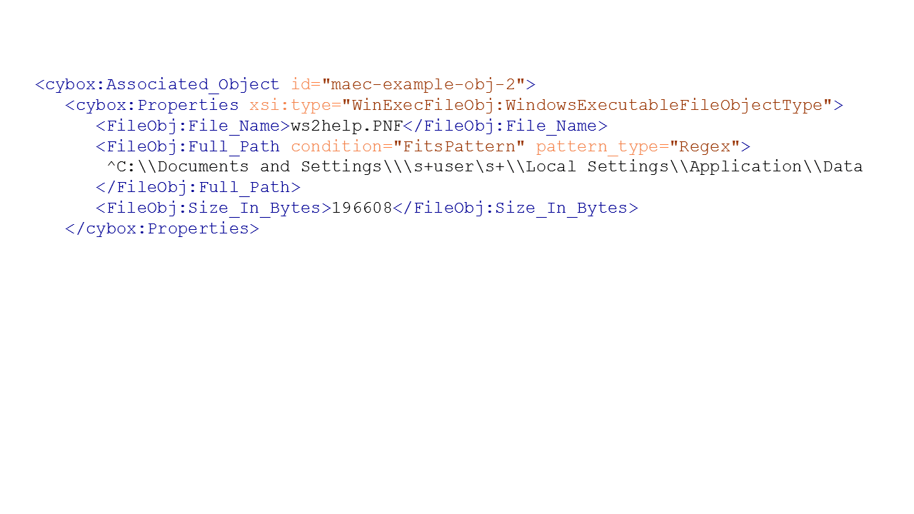

This page contains commonly characterized features (whether statically, dynamically, or manually identified in malware), along with their mappings to MAEC/CybOX object element(s), the associated MAEC/CybOX schema, the typical MAEC schema location(s) (specified via a quasi-XPath like expression) of the object element(s) and associated attributes (captured in [square brackets]), and an explicit XML representation example. Only the most commonly used object elements are listed for each feature; please refer to the applicable schemas for the complete lists.  For the purposes of this section, we define <a href="http://maecproject.github.io/documentation/common_features/table/">MAEC and CybOX data models and namespace prefixes</a>.

### File Attributes

<table>
  <tr>
    <th>MAEC/CybOX Object Element(s)</th>
    <th>MAEC/CybOX Schema(s)</th>
  </tr>
  <tr>
    <td>
      <ul>
	    <li> File/File_Name
		<li> File/File_Path
		<li> File/Size_In_Bytes
	  </ul
	  >
    </td>
    <td>
      <ul>
        <li> CybOX:FileObj
   	    <li> CybOX:WinFileObj
		<li> CybOX:WinExecFileObj
	  </ul>
    </td>
  </tr>
  <tr>
    <th colspan="2">Typical MAEC Schema Location(s)</th>
  </tr>
  <tr>
    <td colspan="2">
    <ul>
	  <li> MAEC_Package/Malware_Subjects/Malware_Subject/Malware_Subject/Malware_Instance_Object_Attributes/Properties[xsi:type=”{ObjectType}”]
	  <li>MAEC_Bundle/Malware_Instance_Object_Attributes/Properties[xsi:type=”{ObjectType}”]
	  <li>MAEC_Bundle/Actions/Action/Associated_Objects/Associated_Object/Properties[xsi:type=”{ObjectType}”]
	  <li>MAEC_Bundle/Objects/Object/Properties[xsi:type=”{ObjectType}”] <li>MAEC_Bundle/Collections/Action_Collections/Action_Collection/Action_List/Action/Associated_Objects/Associated_Object/Properties[xsi:type=”{ObjectType}”]
	  <li>MAEC_Bundle/Collections/Object_Collections/Object_Collection/Object_List/Object/Properties[xsi:type=”{ObjectType}”]
	</ul>
	</td>
  </tr>
  <tr>
    <th colspan="2">MAEC/CybOX XML Representation Example</th>
  </tr>
  <tr>
    <td colspan="2">

    </td>
  </tr>
</table>
    	
		   
