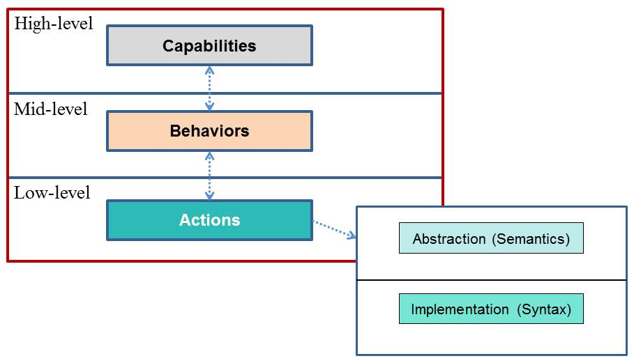

The MAEC Bundle data model provides the ability to capture and share data obtained from the analysis of a single malware instance.  In terms of its most elemental structure, the MAEC Bundle data model can be thought of as having three interconnected layers, as shown in the figure.  

While the MAEC Bundle data model also includes other components, the Actions, Behaviors, and Capabilities are key pieces of its underlying structure, and so we discuss each in further detail below.  

<h4>Low-Level Actions</h4>
At the lowest layer, MAEC Actions answer the question of “what” the malware instance does on a system or network, and thus they characterize hardware accesses, network activity, and system state changes performed by malware.  As such, MAEC Action entities describe attributes tied to the basic functionality and low-level operation of malware, including system state changes such as the insertion of a registry key or the creation of a file.  Therefore, likely sources of such data include static analysis, dynamic analysis of malware binaries through sandboxes, and host-based and network-based intrusion detection and prevention systems (IDPS).

<h4>Mid-Level Behaviors</h4>
The more interesting structure of the MAEC Bundle data model begins at the middle layer, which we term Behaviors. Behaviors are aimed at organizing and defining the purpose behind low-level Actions, whether in groups or as singletons. Thus, Behaviors serve to describe “how” a malware instance operates at significant level of abstraction, and can therefore represent discrete components of malware functionality at a level that is useful for analysis, triage, and detection. 

<h4>High-Level Capabilities</h4>
At the more conceptual and upper-most layer, MAEC defines Capabilities.  Similar to the relationship between Behaviors and Actions, Capabilities serve to organize groups of Behaviors, and therefore they offer a standard way of capturing the set of high-level abilities that a malware instance possesses.  However, the key difference between Behaviors and Capabilities is that while Behaviors are intended to describe “how” a malware instance operates, Capabilities are meant to state “what” it is capable of doing.  In this sense, a Behavior may serve to describe a particular implementation of a Capability in a malware instance