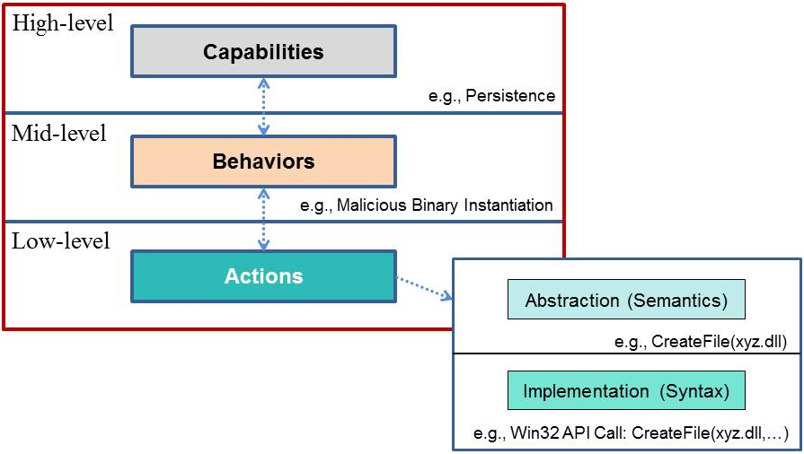

The MAEC Bundle data model provides the ability to capture and share data obtained from the analysis of a single malware instance.  In terms of its most elemental structure, the MAEC Bundle data model can be thought of as having three interconnected layers, as shown in the figure.  

While the MAEC Bundle data model also includes other components, the Actions, Behaviors, and Capabilities are key pieces of its underlying structure, and so we discuss each in further detail below.  We also provide an <a href="#exmap">example mapping</a> and describe the <a href="#bformat">MAEC Bundle output format</a>.

## Low-Level Actions
At the lowest layer, MAEC Actions answer the question of “what” the malware instance does on a system or network, and thus they characterize hardware accesses, network activity, and system state changes performed by malware.  As such, MAEC Action entities describe attributes tied to the basic functionality and low-level operation of malware, including system state changes such as the insertion of a registry key or the creation of a file.  Therefore, likely sources of such data include static analysis, dynamic analysis of malware binaries through sandboxes, and host-based and network-based intrusion detection and prevention systems (IDPS).

Actions can describe a wide range of activities, although initially we have concentrated on defining those that can be achieved through low-level API calls.  By design, MAEC Actions are relatively devoid of any significant intention:  while they answer the question of “what” the malware does, they don’t answer the question of “why” the malware performed the actions in the first place. 

Actions are represented at both semantic and syntactic levels in order to abstract actions from their implementations. Such abstracted Actions allow for the construction of a more concise grammar and also facilitate correlation between malware instances that may do similar things at this level but with vastly different implementations (such as malware targeted at different platforms). On the other hand, the implementation of a particular action or action type may provide insight that can be valuable for correlation or even attribution.

## Mid-Level Behaviors
The more interesting structure of the MAEC Bundle data model begins at the middle layer, which we term Behaviors. Behaviors are aimed at organizing and defining the purpose behind low-level Actions, whether in groups or as singletons. Thus, Behaviors serve to describe “how” a malware instance operates at significant level of abstraction, and can therefore represent discrete components of malware functionality at a level that is useful for analysis, triage, and detection. 

For instance, the description of a registry entry created or modified by malware can be useful for establishing its presence on a system. However, it does not give any insight into why the malware created or manipulated the registry entry. Such a registry entry inserted or modified by a malware instance could be associated with different behaviors.  For example, the registry entry could be used to ensure that the malware gets executed when the system boots, or it could be used as a simple flag to indicate that the system has been infected.  As we will discuss in the next section, including the necessary components for characterizing such mid-level Behaviors in the MAEC Language allows for the accurate description of the possible high-level intent or goals (i.e., Capabilities) that are behind the low-level Actions being performed by malware.

## High-Level Capabilities
At the more conceptual and upper-most layer, MAEC defines Capabilities.  Similar to the relationship between Behaviors and Actions, Capabilities serve to organize groups of Behaviors, and therefore they offer a standard way of capturing the set of high-level abilities that a malware instance possesses.  However, the key difference between Behaviors and Capabilities is that while Behaviors are intended to describe “how” a malware instance operates, Capabilities are meant to state “what” it is capable of doing.  In this sense, a Behavior may serve to describe a particular implementation of a Capability in a malware instance.

For example, ensuring that a malware instance is executed at start-up (e.g., by creating a binary copy of the malware somewhere on the local hard disk and/or by creating a particular registry entry) is a Behavior that is typically part of a ‘Persistence’ Capability.  Other examples of Capabilities include ‘Propagation’, ‘Self-Defense’, and ‘Data Theft’.  Because there is a relatively low upper bound on the number of possible capability types, MAEC Capabilities can be useful in terms of understanding the functionality of malware at a very high level.

Once higher order classifications are made, we envision that the Capabilities taxonomy will have “views” intended for different target audiences. For example, forensic analysts may only be interested in looking at malware payload Capabilities and Behaviors, while a SOC analyst might want to view Capabilities and Behaviors related to command and control.

##  Example Mapping

As a very simple example of how a malicious activity can be mapped between the MAEC Bundle levels, let’s say that a malware instance calls the Windows “CreateFile“ API to create the file “xyz.dll.” This event would first be mapped to the ‘Create File’ Action, and after further investigation, we might conclude that this file was created as a means of instantiating a malicious binary on a system, thus mapping to a ‘Malicious Binary Instantiation’ Behavior.  Finally, the ‘Malicious Binary Instantiation’ Behavior could be considered part of a malware ‘Persistence’ Capability.  This is illustrated in the figure below.

##  The MAEC Bundle Output Format
The MAEC Bundle XML schema (namesake of the MAEC Bundle data model) is currently the standard output format that can be used to describe a single malware instance as a MAEC Bundle schema instance.  As shown in Figure 2 4, the MAEC Bundle schema serves as a container and transport mechanism for use in storing and subsequently sharing MAEC-encoded information about malware, which may include MAEC Actions, Behaviors, and Capabilities as well as other attributes obtained from the characterization of a malware instance.

<figcaption>MAEC Bundle schema overview</figcaption>

A MAEC Bundle is very flexible and can be used to describe anything from a particular insertion method (composed of several low-level Actions and mid-level Behaviors) to any or all of the attributes listed in the figure.  A MAEC Bundle can contain intelligence-derived indicators as well as other signatures and patterns useful in network and host-based intrusion detection.

High level definitions of the basic components of the MAEC Bundle schema are given below.

▪ <u>Malware Instance Object Attributes</u> – Captures details of the malware instance that the MAEC Bundle characterizes using its enumerations and schema. Most commonly, this is a file object with a few attributes, such as name, size, and cryptographic hashes.

▪ <u>AV Classifications</u> – Captures any Anti-Virus scanner tool classifications of the malware instance.

▪ <u>Process Tree</u> – Specifies the observed process tree of execution for the malware instance.

▪ <u>Capabilities</u> – Encompasses all of the MAEC Capabilities in the MAEC Bundle.  Each Capability entity can contain information such as properties, Strategic and Tactical Objectives associated with the Capability (defined next), related Behaviors, and relationships to other Capabilities.

<u>Strategic Objectives</u> – Capture the details of a Capability with additional granularity.  A Capability can have one or more Strategic Objectives that it attempts to carry out. 

▪ <u>Behaviors</u> – Encompasses all of the MAEC Behaviors in the MAEC Bundle.  Each Behavior entity can contain information such as a textual description of the Behavior, related Actions, and relationships to other Behaviors.

▪ <u>Actions</u> – Encompasses all of the MAEC Actions in the MAEC Bundle.  Each Action entity can contain information such as the type of Action that it represents (e.g., ‘create file’, ‘copy file’), discovery method and associated tools, and relationships to other Actions.

▪ <u>Objects</u> – Encompasses all of the MAEC Objects in the MAEC Bundle.  Each Object entity can contain information such as the type of Object that it represents (e.g., ‘file’, ‘process’), specific properties of the Object (e.g., ‘file name’, ‘process name’), and relationships to other Objects.

▪ <u>Candidate Indicators</u> – Encompasses all of the MAEC Candidate Indicators in the Bundle.  Each Candidate Indicator entity can contain information such as importance, author, description, and target information.

▪ <u>Collections</u> – Encompasses all of the MAEC Collections in the MAEC Bundle: Behavior Collections, Action Collections, Object Collections, and Candidate Indicator Collections.  Each Collection entity can contain information such as a text description of the Collection, a characterization of how the elements are related, and a list of the Behaviors/Actions/Objects/Candidate Indicators themselves.

A MAEC Bundle can be used to encompass a set of malware attributes with a particular significance (e.g., a persistence-related Behavior), or it can simply serve as a generic container for MAEC-characterized malware data pertaining to a single malware instance. Therefore, it can be used with as little or as much information as desired; any further meaning beyond the explicit data stored in the MAEC Bundle is determined by its producer.

Note that instead of capturing all malware attributes associated with a malware instance in a single MAEC Bundle, a user may have a need to use multiple MAEC Bundles.  For example, a user may choose to use several different tools in the analysis of the malware instance, each of which creates a separate MAEC Bundle. In this case, the collection of MAEC Bundles can be shared as part of a MAEC Package, described next in Section 2.2. However, it is also perfectly valid to merge multiple MAEC Bundles into a single MAEC Bundle, if so desired.  Identifiers should be preserved so that after merging, it will be possible to determine the original source Bundle of a particular entity through its identifier.

