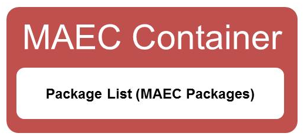

The MAEC Container data model enables a user to share any collection of MAEC characterized data.  Currently, the data model simply enables a user to share a collection of <a href="/documentation/data_model_overview/package/">MAEC Packages</a>.  The data model will be expanded and further defined to include other components as dictated by future needs.

## The MAEC Container Output Format

The MAEC Container XML schema is currently the standard output format that can be used to share any collection of MAEC data.  As illustrated, the content of a MAEC Container simply includes a set of MAEC Packages.

<figcaption><b>MAEC Container schema overview</b></figcaption>

The structure of the MAEC Container schema is provided in detail in the <a href="http://maec.mitre.org/language/version4.1/MAEC_Container_Spec_v2_1.pdf">MAEC Container Specification</a>.
