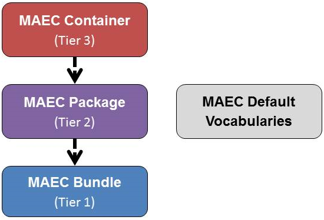

<table class="table-no-border">
<tr>
<td colspan="2">Version 4.1 of the MAEC Language is defined by three data models, each of which is implemented in its own XML schema.  There is also a default vocabularies schema, which defines a default set of controlled vocabularies used within MAEC.
</td>
</tr>
<tr>
<td width="50%">
As illustrated, “MAEC Bundle” is the (lowest) Tier 1 data model; “MAEC Package” is the (middle) Tier 2 data model; and “MAEC Container” is the (highest) Tier 3 data model.  All three data models offer a stand-alone output format, so a lower level model can be used without the higher tier data model (although each model level requires all lower tiers).  This three-tiered structure provides flexibility in the type and amount of information that can be shared.
</td>
<td width="50%">

</td>
</tr>
</table> 

  

    

      <h4>MAEC Bundle Data Model for MAEC Version 4.1</h4>
      
The MAEC Bundle data model provides the ability to capture and share data obtained from the analysis of a single malware instance.  

	  <a class="btn btn-primary" href="bundle">MAEC Bundle »</a>
    

  	

      <h4>MAEC Package Data Model for MAEC Version 4.1</h4>
      
The MAEC Package data model enables a user to share MAEC characterized data for one or more Malware Subjects.

      <a class="btn btn-primary" href="package">MAEC Package »</a>
    

  

  

  	

      <h4>MAEC Container Data Model for MAEC Version 4.1</h4>
      
The MAEC Container data model enables a user to share any collection of MAEC characterized data.

	  <a class="btn btn-primary" href="container">MAEC Container »</a>
    

  

