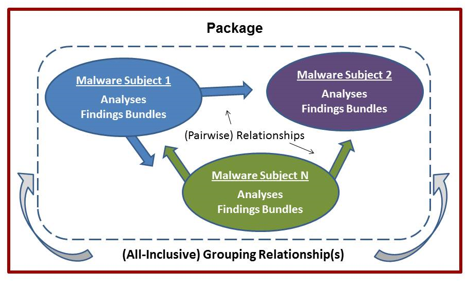
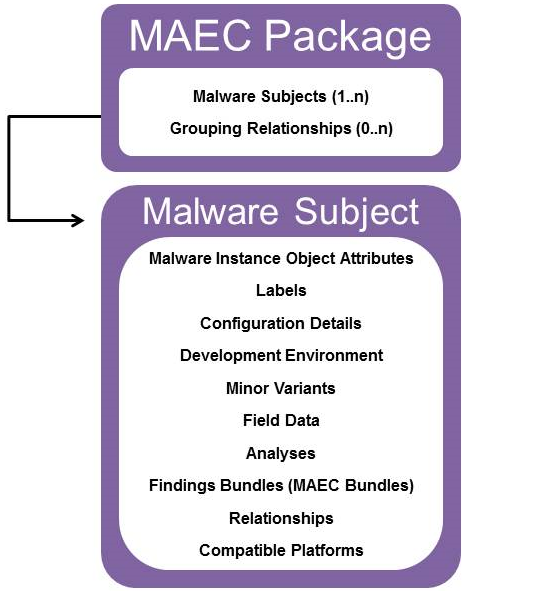

Before we discuss the MAEC Package data model, we must define the Malware Subject entity.  A Malware Subject contains details of a particular malware instance (e.g., a file as identified by MD5 and/or SHA1 hash), any minor variants of the same instance that may have been observed (e.g., the same file but with different names), along with all of the analyses that were performed on the instance, any findings generated from the analyses, and any other metadata.  As such, the Malware Subject is MAEC’s representation of a malware instance and all of the known data associated with it.

The MAEC Package data model enables a user to share MAEC characterized data for one or more Malware Subjects; in most such cases, the Malware Subjects are related in some manner.  For example, the Malware Subjects captured in a MAEC Package might include files that are created or dropped during a dynamic analysis, variants of the same malware family, or files that are identified as being similar by a clustering algorithm.  In addition to encompassing a collection of MAEC Bundles associated with each of the Malware Subjects, the MAEC Package data model also defines elements that enable the sharing of analysis and relationship information. 

As shown in the figure, a MAEC Package encompasses one or more Malware Subjects, each of which includes its own analysis metadata and MAEC Bundles (i.e., Findings Bundles, defined below). Also captured within the MAEC Package are any relationships between pairs of Malware Subjects, along with   relationship information for the entire collection of Malware Subjects (i.e., Grouping Relationships, defined below).

## The MAEC Package Output Format

The MAEC Package XML schema is currently the standard output format that can be used to describe one or more Malware Subjects using MAEC’s enumerations and schema.  As illustrated, the content of a MAEC Package includes a set of Malware Subjects and Grouping Relationship information, where the content of a Malware Subject includes additional information:  Malware Instance Object Attributes, labels, configuration details, development environment details, minor variant information, field data, analysis information, MAEC Bundles associated with the Malware Subject, information about the relationships between the Malware Subject of focus and other Malware Subjects, and compatible platform information.  In essence, a MAEC Package enables MAEC Bundle management, allowing users to share multiple MAEC Bundles and associated metadata for one or more Malware Subjects.

<figcaption><b>MAEC Package schema overview</b></figcaption>

The structure of the MAEC Package schema is provided in detail in the <a href="http://maec.mitre.org/language/version4.1/MAEC_Package_Spec_v2_1.pdf">MAEC Package Specification</a>, but we give high level definitions for the basic components below:

* **Malware Subject** – Represents a single malware object (most commonly a file) and its associated metadata:
  * **Malware Instance Object Attributes** – Contains details of the specific properties of the malware instance characterized by the Malware Subject; for example, its MD5 hash.  Note that this information may be repeated in a MAEC Bundle if the MAEC Bundle is to be self-contained. 
  * **Label** – Specifies a commonly accepted label to describe the Malware Subject, e.g., "worm." More than one label may be specified through the use of multiple instances of this field.
  * **Configuration Details** – Captures details of the configuration specified for the Malware Subject, such as configuration parameters.
  * **Development Environment** – Captures details of the development environment used in the creation of the malware instance characterized by the Malware Subject.
  * **Minor Variants** – Captures any observed minor variants of the malware instance characterized by the Malware Subject, such as identical files with different names.
  * **Field Data** – Captures field data and prevalence information relating to the malware instance characterized by the Malware Subject.
  * **Analyses** – Captures analysis-related details for the Malware Subject such as analyst, source, summary, and tool information.  Analyses can reference one or more individual MAEC Bundles to denote that the findings of the analysis are captured in the Bundles.
  * **Findings Bundles** – Set of MAEC Bundles pertaining to the Malware Subject of focus.  For example, these MAEC Bundles could capture the output of different tools, some data obtained through manual malware analysis, etc.  The term “Findings_Bundles” is used rather than simply “Bundles” to imply that the content was derived from analysis.
  * **Relationships** – Captures uni-directional relationships between the Malware Subject of focus and other Malware Subjects.  Examples include ‘downloaded by,’ ‘dropped by,’ ‘downloads,’ and ‘drops.’
  * **Compatible Platform** – Specifies a single platform with which the Malware Subject is compatible (i.e., on which the Malware Subject can execute). More than one compatible platform may be specified through the use of multiple instances of this field.
* **Grouping Relationship** – Specifies the particular relationship between all of the Malware Subjects encompassed in the MAEC Package.  Example relationships include ‘same malware family’ and ‘clustered together’ (possibly by a malware analysis clustering algorithm).
