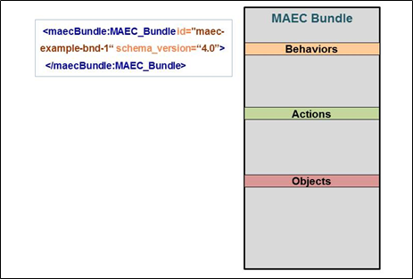

The MAEC Bundle is the primary entity for capturing the output of analyses performed on a malware instance, such as through one or more tools. In this idiom, we'll discuss the creation of a basic MAEC Bundle and describe its two supported uses, including in a standalone capacity, as well as part of a Malware Subject in a MAEC Package.

## Uses
The [MAEC Bundle](/data-model/{{site.current_version}}/maecBundle/BundleType) can be used in two distinct ways:

1.	In a standalone capacity. When one wishes to share ONLY the analysis-derived information about a malware instance, such as the actions performed, a Bundle can be used by itself, without being embedded in a [Malware Subject](/data-model/{{site.current_version}}/maecPackage/MalwareSubjectType) as part of a [MAEC Package](/data-model/{{site.current_version}}/maecPackage/PackageType). This is the less common usage, but may be preferable when the associated structure and metadata included in a Malware Subject is deemed unnecessary. In this form, the Bundle MUST capture the identity of the malware instance whose data it characterizes, via its Malware_Instance_Object_Attributes field.

2.	As part of a [Malware Subject](/data-model/{{site.current_version}}/maecPackage/MalwareSubjectType) in a [MAEC Package](/data-model/{{site.current_version}}/maecPackage/PackageType). When embedded in a Malware Subject, a Bundle serves to capture the output of some particular analysis performed on a malware instance, such as the execution of a static analysis tool. Thus, multiple Bundles may be embedded in this manner, to enable the more granular capture of malware analysis output. This is the more common usage, as it is often useful to share the associated metadata that the [Malware Subject](/data-model/{{site.current_version}}/maecPackage/MalwareSubjectType) can capture. In this form, the Bundle SHOULD NOT capture the identity of the malware instance whose data it characterizes, as this is achieved through the identical Malware_Instance_Object_Attributes field on the Malware Subject.

## Data model
The [MAEC Bundle](/data-model/{{site.current_version}}/maecBundle/BundleType) has three required attributes:

1.  *id*. The "id" field is intended to capture a globally unique identifier for the Bundle. The recommended form for MAEC identifier attributes is "maec-namespace-bundle-unique_identifier" where the namespace is optional and specified by the producer.  It is recommended that the namespace be meaningful and that the identifier portion be a globally unique ID (GUID).  For example, the identifier "maec-anubis_to_maec-bundle-5cbf19d5-9067-4202-8424-b3676f51b606" uses the namespace "anubis_to_maec" to specify that the Anubis to MAEC translator tool  was used to create the MAEC output.  It is also recommended that the same namespace be used throughout a Bundle, although this is not required. 

2.	*schema_version*.  The "schema_version" field specifies the version of the MAEC Bundle schema used to create the Bundle. 

3.	*defined_subject*.  The "defined_subject" field specifies whether the subject attributes of the characterized malware instance are included inside the Bundle (via the top-level Malware_Instance_Object_Attributes field) or elsewhere (such as a MAEC Subject in a MAEC Package). Thus, a value of "true" is valid only for use in a standalone Bundle, and conversely a value of "false" is valid only for a Bundle embedded in a Malware Subject. 

Besides these required attributes, there are also a few that are recommended for use in order to provide additional context about the construction and content of the bundle. These are the following:

1.	*content_type*.  The "content_type" field specifies the general type of content contained in this Bundle, e.g. static analysis tool output, dynamic analysis tool output, etc. 

2.	*timestamp*.  The "timestamp" field specifies the date/time that the bundle was created.

## Example
Now that we've defined the basic properties and usage of the [MAEC Bundle](/data-model/{{site.current_version}}/maecBundle/BundleType), let's build an example instance. For this scenario, let's assume that we're building a standalone Bundle to capture the analysis-derived output for a malicious PDF file, for which we know the file name (User_Manual.pdf), its size (509328 bytes), and PDF version number (1.6). 

First, we'll need to set the required attributes. We'll assume that the "id" field will be populated by a tool or code, and that the "schema_version" will take the value corresponding to the latest version of the Bundle schema, {{site.current_version}}. The last required attribute, "defined_subject", should be set to a value of "true" since we're dealing with a standalone Bundle, in order to indicate that we're defining the properties of the malware instance inside of the Bundle and not elsewhere. On the other hand, if we were dealing with a Bundle embedded in a [Malware Subject](/data-model/{{site.current_version}}/maecPackage/MalwareSubjectType), we'd set "defined_subject" to a value of "false". 

Next, since we're dealing with a standalone Bundle, we'll need to populate the "Malware_Instance_Object_Attributes" field, to provide the identity of the PDF file that we're characterizing. The base type of this field is the [CybOX ObjectType](/data-model/{{site.current_version}}/cybox/ObjectType), and therefore it has an extension point via its [Properties](/data-model/{{site.current_version}}/cyboxCommon/ObjectPropertiesType) field where the properties of one of the CybOX defined objects may be used. Since we're dealing with a PDF file in this example, we'll use the defined [CybOX PDF File Object](/data-model/{{site.current_version}}/PDFFileObj/PDFFileObjectType) as the extension for the Properties field. Specifically, we'll use its derived (from the base File Object) "File_Name" and "Size_In_Bytes" fields, as well as the native "Version" field to capture the known information about the identity of the malware instance.

With the "Malware_Instance_Object_Attributes" and required attributes populated, we've now created our basic, standalone MAEC Bundle. However, as indicated by the placeholders in the figure, Objects, Actions, and Behaviors should be added as a result of the analyses on the malicious file as performed by tools and analysts. We'll leave the description and details of these to other Idioms - please see the Further Reading section below. 

Also, note that a Bundle embedded in a [Malware Subject](/data-model/{{site.current_version}}/maecPackage/MalwareSubjectType) would be nearly identical in composition, with the differences being that it would not include the "Malware_Instance_Object_Attributes" field, and that its "defined_subject" field would be set to "false".

## XML


<maecBundle:MAEC_Bundle id="example:bundle-262d625d-61b5-4a92-ad76-3a3ac23fbac7" schema_version="4.1" defined_subject="true">
  <maecBundle:Malware_Instance_Object_Attributes>
   <cybox:Properties xsi:type="PDFFileObj:PDFFileObjectType">
    <FileObj:File_Name>User_Manual.pdf</FileObj:File_Name>
    <FileObj:Size_In_Bytes>509328</FileObj:Size_In_Bytes>
    <PDFFileObj:Version>1.6</PDFFileObj:Version>
   </cybox:Properties>
  </maecBundle:Malware_Instance_Object_Attributes>
</maecBundle:MAEC_Bundle>



[Full XML](maec_basic_bundle.xml)
## Python


# Instantiate the Bundle and populate its required attributes
# The ID generation is handled automatically by python-maec
b = Bundle()
b.defined_subject = "True"

# Populate the Malware_Instance_Object_Attributes of the Bundle with the properties of the PDF file
b.malware_instance_object_attributes = Object()
b.malware_instance_object_attributes.properties = PDFFile()
b.malware_instance_object_attributes.properties.file_name = "User_Manual.pdf"
b.malware_instance_object_attributes.properties.size_in_bytes = "509328"
b.malware_instance_object_attributes.properties.version = "1.6"


[Full Python](maec_basic_bundle.py)
## Further Reading
* [Creating a MAEC Package] (../package_creation)
