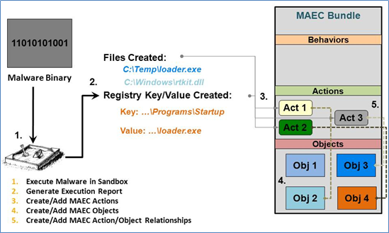

This Idiom describes the process of capturing the results of dynamic analysis performed on some malware instance, such as through the use of a malware sandbox tool. As with all analysis-derived results, those that come from dynamic analysis can be captured through the use of a MAEC Bundle. However, dynamic analysis results will be captured almost exclusively through the use of the [Malware Action](/data-model/{{site.current_version}}/maecBundle/MalwareActionType) entity.

## Scenario

In this scenario, a malicious PE binary has been analyzed through the freely available ThreatExpert sandbox service, which provides information about the low-level actions that the PE binary performs when executed. For the sake of brevity in this example, we'll focus on two actions as reported by the sandbox: the creation of a file, and the creation of a mutex.

## Data model
As with many of the other Idioms, the first step is to create a [MAEC Package](/data-model/{{site.current_version}}/maecPackage/PackageType) with a [Malware Subject](/data-model/{{site.current_version}}/maecPackage/MalwareSubjectType) for capturing the information about the malware instance being analyzed. We should also add an [Analysis](/data-model/{{site.current_version}}/maecPackage/AnalysisType) entity to the Malware Subject to capture some details relating the particular analysis that we're performing. Further details on this process can be found at [URL] (some_url).

Next, a [MAEC Bundle](/data-model/{{site.current_version}}/maecBundle/BundleType) is created. Once created, we must set the "content_type" attribute on the Bundle to define the type of content that it is characterizing.  In this case, since we're capturing the output of a dynamic analysis tool, we should set it to a value of "dynamic analysis tool output". This is one of the values contained in the BundleContentTypeEnum enumeration used by this field. Finally, we should set the defined_subject attribute on the Bundle to a value of "false", since this Bundle will be contained in a Malware Subject, which has already defined the particular malware instance being characterized.

Now that we've set up the Bundle that will capture the dynamic analysis results, we can begin to populate it with these results. As depicted in the figure, we'll be using the [Malware Action](/data-model/{{site.current_version}}/maecBundle/MalwareActionType) entity to capture the output of the dynamic analysis tool that has recorded some of the behavior that the malware instance exhibits when executed. Since we're dealing with two reported actions in this scenario, we'll need to create two instances of the [Malware Action](/data-model/{{site.current_version}}/maecBundle/MalwareActionType) entity, one for capturing each action. 

The first action reported by the sandbox involved the creation of a particular file. Thus, the first thing to set on this action is set the value of the "Name" field, which makes use of MAEC's default vocabularies to specify the name of the action that was performed. In this case, we'll use the "create file" value from the [File Action Name Vocabulary](/data-model/{{site.current_version}}/maecVocabs/FileActionNameVocab-1.1), since it corresponds directly to the action. Next, we need to capture the particular Objects that the action operated on, which is achieved through the use of the [Associated Objects](/data-model/{{site.current_version}}/cybox/AssociatedObjectsType) field in the action. Specifically, we'll want to add an [Associated Object](/data-model/{{site.current_version}}/cybox/AssociatedObjectType) to this list, for specifying the properties of the Object that this "create file" action operated on. To do so, we'll populate the [Properties](/data-model/{{site.current_version}}/cyboxCommon/ObjectPropertiesType) extension point of the Associated Object using a CybOX defined object that corresponds to the type of object used in the action. In this case, we'll use the [CybOX Windows Executable Object](/data-model/{{site.current_version}}/WinExecutableFileObj/WindowsExecutableFileObjectType), since the sandbox reported that the created file ends in ".exe", so we'll assume it's a Windows Executable File.  After setting the corresponding "File_Name" and "Size_In_Bytes" fields on the Properties of the Associated Object, as reported by the sandbox, we also need to capture the relationship between the Action and Associated Object. This is achieved by setting the "Association_Type" field on the Associated Object, which uses the "maecVocabs:ActionObjectAssociationTypeVocab-1.0" as its default vocabulary. Thus, since the file in this case is created, or in other words ends up as the output of the action, we should use a value of "output" for the "Association_Type" field.

The second action reported by the sandbox involved the creation of a particular mutex, and is created in much the same fashion as the first. Thus, the first thing to set on this action is set the value of the "Name" field, which makes use of MAEC's default vocabularies to specify the name of the action that was performed. In this case, we'll use the "create mutex" value from the [Synchronization Action Name Vocabulary](/data-model/{{site.current_version}}/maecVocabs/SynchronizationActionNameVocab-1-1.1), since it corresponds directly to the action. Next, we need to capture the particular Objects that the action operated on, which is achieved through the use of the [Associated Objects](/data-model/{{site.current_version}}/cybox/AssociatedObjectsType) field in the action. Specifically, we'll want to add an [Associated Object](/data-model/{{site.current_version}}/cybox/AssociatedObjectType) to this list, for specifying the properties of the Object that this "create mutex" action operated on. To do so, we'll populate the [Properties](/data-model/{{site.current_version}}/cyboxCommon/ObjectPropertiesType) extension point of the Associated Object using a CybOX defined object that corresponds to the type of object used in the action. In this case, we'll use the [CybOX Windows Mutex Object](/data-model/{{site.current_version}}/WinMutexObj/WindowsMutexObjectType), since this is the corresponding Mutex Object for Windows.  After setting the corresponding "Name" field (capturing the name of the mutex) on the Properties of the Associated Object, as reported by the sandbox, we also need to capture the relationship between the Action and Associated Object. This is achieved by setting the "Association_Type" field on the Associated Object, which uses the "maecVocabs:ActionObjectAssociationTypeVocab-1.0" as its default vocabulary. Thus, since the mutex in this case is created, or in other words ends up as the output of the action, we should also use a value of "output" for the "Association_Type" field.   

With these two actions created, the remaining task is to add them to the [Bundle](/data-model/{{site.current_version}}/maecBundle/BundleType) that was previously created. To do this, we simply need to use the [Actions](/data-model/{{site.current_version}}/maecBundle/ActionListType) field at the root level of the Bundle, to which we'll add the "create file" and "create mutex" actions that we previously created.

## XML


<maecPackage:Bundle defined_subject="false" id="example:bundle-24e932a3-5508-4128-b800-32b35bfab0b2" schema_version="4.1" content_type="dynamic analysis tool output">
	<maecBundle:Actions>
		<maecBundle:Action id="example:action-e6ecdda7-6a70-4320-8e54-5c956c778b7b">
			<cybox:Name xsi:type="maecVocabs:FileActionNameVocab-1.0">create file</cybox:Name>
			<cybox:Associated_Objects>
				<cybox:Associated_Object>
					<cybox:Properties xsi:type="WinExecutableFileObj:WindowsExecutableFileObjectType">
						<FileObj:File_Name>Zcxaxz.exe</FileObj:File_Name>
						<FileObj:Size_In_Bytes>332288</FileObj:Size_In_Bytes>
					</cybox:Properties>
					<cybox:Association_Type xsi:type="maecVocabs:ActionObjectAssociationTypeVocab-1.0">output</cybox:Association_Type>
				</cybox:Associated_Object>
			</cybox:Associated_Objects>
		</maecBundle:Action>
		<maecBundle:Action id="example:action-e5e6fd60-77ea-4489-a801-f2b56bfccb22">
			<cybox:Name xsi:type="maecVocabs:SynchronizationActionNameVocab-1.0">create mutex</cybox:Name>
			<cybox:Associated_Objects>
				<cybox:Associated_Object>
					<cybox:Properties xsi:type="WinMutexObj:WindowsMutexObjectType" named="true">
						<MutexObj:Name>redem-Mutex</MutexObj:Name>
					</cybox:Properties>
					<cybox:Association_Type xsi:type="maecVocabs:ActionObjectAssociationTypeVocab-1.0">output</cybox:Association_Type>
				</cybox:Associated_Object>
			</cybox:Associated_Objects>
		</maecBundle:Action> 
	</maecBundle:Actions>
</maecPackage:Bundle>


[Full XML](maec_dynamic_analysis.xml)
## Python


# Create the first, create file action
act1 = MalwareAction()
act1.name = "create file"
act1.name.xsi_type = "FileActionNameVocab-1.1"
act1.associated_objects = AssociatedObjects()
o1 = AssociatedObject()
o1.properties = WinExecutableFile()
o1.properties.file_name = "Zcxaxz.exe"
o1.properties.size_in_bytes = "332288"
o1.association_type = VocabString()
o1.association_type.value = "output"
o1.association_type.xsi_type = "maecVocabs:ActionObjectAssociationTypeVocab-1.0"
act1.associated_objects.append(o1)

# Create the second, create mutex action
act2 = MalwareAction()
act2.name = "create mutex"
act2.name.xsi_type = "SynchronizationActionNameVocab-1.0"
act2.associated_objects = AssociatedObjects()
o2 = AssociatedObject()
o2.properties = WinMutex()
o2.properties.name = "redem-Mutex"
o2.association_type = VocabString()
o2.association_type.value = "output"
o2.association_type.xsi_type = "maecVocabs:ActionObjectAssociationTypeVocab-1.0"
act2.associated_objects.append(o2)


[Full Python](maec_dynamic_analysis.py)

## Further Reading
* [Creating a MAEC Bundle] (../bundle_creation)
* [Capturing Static Analysis Results] (../static_analysis)