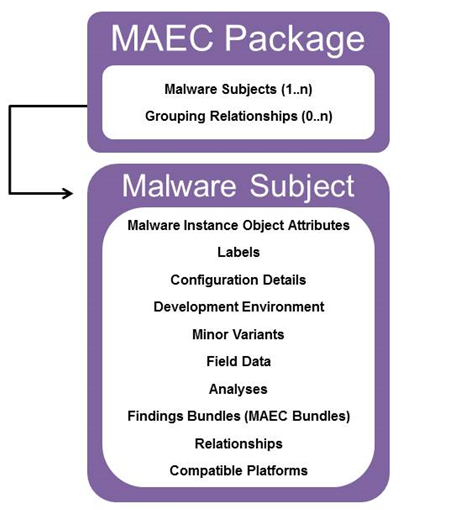

This Idiom demonstrates how to capture basic information about a single malware instance with the MAEC Package, through the use of its Malware Subject entity. While we'll describe the basic process of creating a Package and Malware Subject here, this process is also applicable to the creation of more detailed content, such as for the capture of static or dynamic analysis results.

## Scenario
In this scenario, we're characterizing a malware instance file with a name of badware.exe, size of 1024 bytes, and MD5 hash of B6C39FF68346DCC8B67AA060DEFE40C2.

## Data model

The following are the important MAEC data model constructs used in this idiom:

1. [MAEC Package](/data-model/{{site.current_version}}/maecPackage/PackageType): the MAEC Package is the MAEC entity that encompasses one or more Malware Subjects, as well as the grouping relationship between them.
2. [Malware Subject](/data-model/{{site.current_version}}/maecPackage/MalwareSubjectType): the Malware Subject entity captures the identity of each malware instance being characterized, as well as all other known data such as the analysis derived findings and any relevant metadata.

The relationship between these entities and some of their properties are highlighted in the diagram on the right. Accordingly, it would be useful to discuss each in more detail. Accordingly, let's examine each in more detail; to start with, a [MAEC Package](/data-model/{{site.current_version}}/maecPackage/PackageType) has two required field:

1.	*id*. The id field captures a globally unique identifier for the Package. The recommended form for MAEC identifier attributes is "maec-namespace-package-unique_identifier" where the namespace is optional and specified by the producer.  It is recommended that the namespace be meaningful and that the identifier be a globally unique ID (GUID).  For example, the identifier "maec-anubis_to_maec-act-49fd2bca-7631-4619-ba9f-2ab32b819122" uses the namespace "anubis_to_maec" to specify that the Anubis to MAEC translator tool was used to create the MAEC output.  It is also recommended that the same namespace be used throughout a Package, although this is not required.

2.	*schema_version*. The schema_version field specifies the version of the schema used to create the Package.

Similarly, a [Malware Subject](/data-model/{{site.current_version}}/maecPackage/MalwareSubjectType) has two required fields:

1.	*id*. As with the Package, the id field is required and should follow the form "maec-namespace-malware_subject-unique_identifier".

2.	*Malware_Instance_Object_Attributes*. The [Malware_Instance_Object_Attributes](/data-model/{{site.current_version}}/cybox/ObjectType) field captures the identity of the malware instance that the Malware Subject characterizes.  Its base type is the [CybOX ObjectType](/data-model/{{site.current_version}}/cybox/ObjectType), and therefore it has an extension point via its [Properties](/data-model/{{site.current_version}}/cyboxCommon/ObjectPropertiesType) field where the properties of one of the CybOX defined objects may be used. 

## Process
Now that we've defined the basic properties and usage of the [MAEC Package](/data-model/{{site.current_version}}/maecPackage/PackageType) and [Malware Subject](/data-model/{{site.current_version}}/maecPackage/MalwareSubjectType), let's build an example instance based on our scenario.

1. To begin, we'll create a [MAEC Package](/data-model/{{site.current_version}}/maecPackage/PackageType), which is the container that encompasses Malware Subjects.  
2. Next, we'll create a [Malware Subject](/data-model/{{site.current_version}}/maecPackage/MalwareSubjectType) instance, for capturing the identity of the malware instance. 
3. For capturing the specific properties of the malware instance in the *Malware_Instance_Object_Attributes* field of the [Malware Subject](/data-model/{{site.current_version}}/maecPackage/MalwareSubjectType), we'll use the defined [CybOX File Object](/data-model/{{site.current_version}}/FileObj/FileObjectType) as the extension for the *Properties* field. More specifically, we will make use of its *File_Name*, *Size_In_Bytes*, and *Hashes* fields to capture the known properties of the malware instance. The first two fields are self explanatory, but the [Hashes](/data-model/{{site.current_version}}/cyboxCommon/HashListType) field is actually a list that encompass multiple hash values. Therefore, we'll populate it with a single [Hash](/data-model/{{site.current_version}}/cyboxCommon/HashType) entry, which contains child fields of *Type* and *Simple_Hash_Value*. For "Type", which captures the type of cryptographic hash that we're capturing, we'll specify a value of `MD5`  from the default CybOX vocabulary that we'll use here, the [HashNameVocab-1.0](/data-model/{{site.current_version}}/cyboxVocabs/HashNameVocab-1.0). Accordingly, *Simple_Hash_Value* is exactly as it sounds, and will be used to capture the MD5 hash value.
4. Finally, we'll add the [Malware Subject](/data-model/{{site.current_version}}/maecPackage/MalwareSubjectType) that we created to the [MAEC Package](/data-model/{{site.current_version}}/maecPackage/PackageType). To do so, we'll populate the [Malware_Subjects](/data-model/{{site.current_version}}/maecPackage/MalwareSubjectListType) field on the Package, which encompasses a list of Malware Subjects. As such, we'll add our Malware Subject to this list.
	
This is but a small portion of what a [MAEC Package](/data-model/{{site.current_version}}/maecPackage/PackageType) and [Malware Subject](/data-model/{{site.current_version}}/maecPackage/MalwareSubjectType) are able to capture. Please refer to the other Idioms for other, more detailed scenarios.
	
## XML


<maecPackage:Malware_Subject id="example:malware_subject-36103092-46c5-4614-8096-142eebccc25b">
	<maecPackage:Malware_Instance_Object_Attributes id="example:object-034e3508-0b44-4614-9e70-ffc6c5c25ac1">
		<cybox:Properties xsi:type="FileObj:FileObjectType">
			<FileObj:File_Name>badware.exe</FileObj:File_Name>
			<FileObj:Size_In_Bytes>1024</FileObj:Size_In_Bytes>
			<FileObj:Hashes>
				<cyboxCommon:Hash>
					<cyboxCommon:Type xsi:type="cyboxVocabs:HashNameVocab-1.0">MD5</cyboxCommon:Type>
					<cyboxCommon:Simple_Hash_Value>B6C39FF68346DCC8B67AA060DEFE40C2</cyboxCommon:Simple_Hash_Value>
				</cyboxCommon:Hash>
			</FileObj:Hashes>
		</cybox:Properties>
	</maecPackage:Malware_Instance_Object_Attributes>
</maecPackage:Malware_Subject>


[Full XML](maec_basic_package.xml)

## Python


# Set up the necessary Package and Malware Subject, Analysis Bundle Instances
p = Package()
ms = MalwareSubject()

# Set the Malware_Instance_Object_Attributes on the Malware Subject
ms.malware_instance_object_attributes = Object()
ms.malware_instance_object_attributes.properties = File()
ms.malware_instance_object_attributes.properties.file_name = "badware.exe"
ms.malware_instance_object_attributes.properties.size_in_bytes = "1024"
ms.malware_instance_object_attributes.properties.add_hash("B6C39FF68346DCC8B67AA060DEFE40C2")

# Build up the full Package/Malware Subject hierarchy
p.add_malware_subject(ms)


[Full Python](maec_basic_package.py)

## Further Reading
* [Creating a MAEC Bundle](../bundle_creation)
* [Capturing Dynamic Analysis Results](../dynamic_analysis)
* [Capturing Static Analysis Results](../static_analysis)