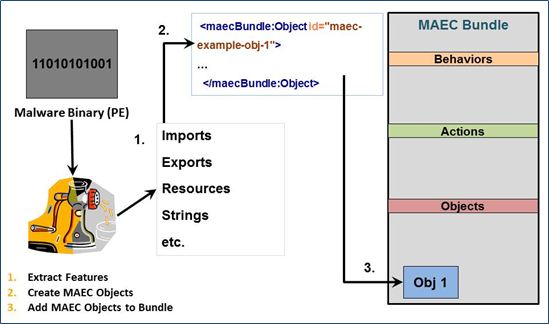

This Idiom describes the process of capturing the results of static analysis performed on some malware instance, such as through the use of a PE file analysis tool. As with all analysis-derived results, those that come from static analysis can be captured through the use of a MAEC Bundle. However, unlike most other analyses, the output of static analysis can be captured using a [CybOX Object](/data-model/{{site.current_version}}/cybox/Object).

## Scenario

In this scenario, a malicious PE binary has been analyzed with the freely available PEiD tool. This tool provides information about Entrypoint and Subsystem defined in the PE headers of the file, as well as the version of linker used in linking the code.

## Data model
As with many of the other Idioms, the first step is to create a [MAEC Package](/data-model/{{site.current_version}}/maecPackage/PackageType) with a [Malware Subject](/data-model/{{site.current_version}}/maecPackage/MalwareSubjectType) for capturing the information about the malware instance being analyzed. We should also add an [Analysis](/data-model/{{site.current_version}}/maecPackage/AnalysisType) entity to the Malware Subject to capture some details relating the particular analysis that we're performing. Further details on this process can be found at [URL] (some_url).

Next, a [MAEC Bundle](/data-model/{{site.current_version}}/maecBundle/BundleType) is created. Once created, we must set the "content_type" attribute on the Bundle to define the type of content that it is characterizing.  In this case, since we're capturing the output of a static analysis tool, we should set it to a value of "static analysis tool output". This is one of the values contained in the BundleContentTypeEnum enumeration used by this field. Finally, we should set the defined_subject attribute on the Bundle to a value of "false", since this Bundle will be contained in a Malware Subject, which has already defined the particular malware instance being characterized.

Now that we've set up the Bundle that will capture the static analysis results, we can begin to populate it with these results. As depicted in the figure, we should use a [CybOX Object](/data-model/{{site.current_version}}/cybox/Object) to capture the output of the static analysis tool that has extracted some features of the PE file that we're analyzing. 

Since we're dealing with a PE file, we should use the defined [CybOX Windows Executable Object](/data-model/{{site.current_version}}/WinExecutableFileObj/WindowsExecutableFileObjectType) to populate the Properties extension point of the CybOX Object. Other types of files that are statically analyzed would require the use of the proper corresponding CybOX defined Object.

Now that we've setup the proper CybOX Object/Properties hierarchy for the type of data that we're capturing, we can begin capturing the individual data points.As we mentioned before, we'll be capturing the entrypoint of the file, as well as the subsystem information and linker version. Since these are all properties stored in the headers of a PE File, we'll use the [Headers](/data-model/{{site.current_version}}/WinExecutableFileObj/PEHeadersType) field as the root for the capture of this data. Furthermore, since these properties are all part of the PE Optional Header, we'll use the corresponding [Optional Header](/data-model/{{site.current_version}}/WinExecutableFileObj/PEOptionalHeaderType) field in the Headers field to capture them. Specifically, we'll use the "Major_Linker_Version" and "Minor_Linker_Version" fields for the linker version, the "Subsystem" field for the subsystem information, and the "Address_Of_Entry_Point" field for the entry point information.

## XML


    <maecPackage:Bundle id="maec-example-bnd-1" schema_version="4.1" defined_subject="false" content_type="static analysis tool output">
     <maecBundle:Objects>
      <maecBundle:Object id="maec-example-obj-1">
        <cybox:Properties xsi:type="WinExecFileObj:WindowsExecutableFileObjectType">
          <WinExecFileObj:Headers>
           <WinExecFileObj:Optional_Header>
            <WinExecFileObj:Major_Linker_Version>06</WinExecFileObj:Major_Linker_Version>
            <WinExecFileObj:Minor_Linker_Version>00</WinExecFileObj:Minor_Linker_Version>
            <WinExecFileObj:Address_Of_Entry_Point>036418</WinExecFileObj:Base_Of_Code>
            <WinExecFileObj:Subsystem>Windows_GUI</WinExecFileObj:Subsystem>
           </WinExecFileObj:Optional_Header>
          </WinExecFileObj:Headers>
          <WinExecFileObj:Type>Executable</WinExecFileObj:Type>
        </cybox:Properties>
       </maecBundle:Object>
     </maecBundle:Objects>
    </maecPackage:Bundle>


[Full XML](malware-characterization-using-maec.xml)
## Python


from maec.bundle.bundle import Bundle

b = Bundle()


## Further Reading

