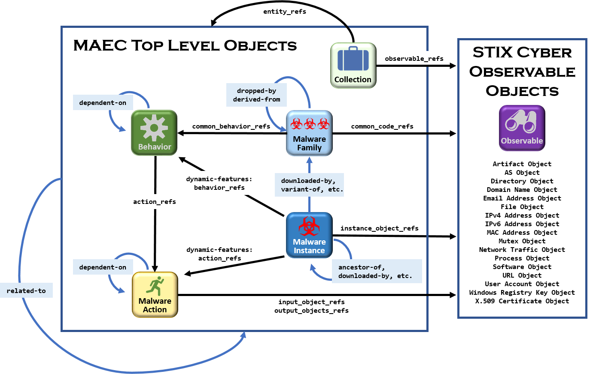
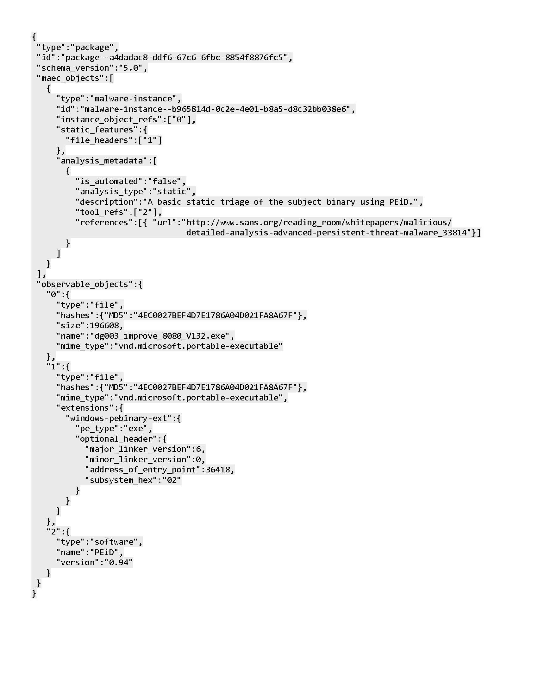

## Introduction

Malicious software &mdash; also called “malware” &mdash; is responsible for a variety of malicious activities, ranging from spam email distribution via botnets to the theft of sensitive information via targeted social engineering attacks. Effectively an autonomous agent operating on behalf of an attacker, malware can perform any action that can be expressed in code, and consequently, poses a significant threat to cybersecurity.

A single instance of undetected malware can result in damaged systems and compromised data. Therefore, most anti-malware efforts focus on preventing damaging effects through early detection using physical signatures and heuristics. However, signature-based detection is generally unsuitable for dealing with zero-day, targeted, polymorphic, and other emerging forms of malware. Furthermore, while heuristic detection might generically detect certain types of malware, it will miss those for which is does not have a pattern. Therefore, while these methods are useful, they cannot be exclusively relied upon.

Because effective malware detection and mitigation requires a variety of analysis and detection methods, a diverse set of vendor or tool-specific data models have evolved. As a result, interpreting and correlating information from an assortment of disparate sources can be a difficult task.    

The goal of [Malware Attribute Enumeration and Characterization (MAEC™)](/releases/5.0), pronounced “mike,” is to provide a basis for transforming malware research and response. MAEC aims to eliminate the ambiguity and inaccuracy that currently exists in malware descriptions and to reduce reliance on signatures. In this way, MAEC seeks to transform malware research and response by improving communication, reducing potential duplication of malware analysis efforts, and allowing for faster development of countermeasures by enabling the ability to leverage responses to previously observed malware instances.

## The MAEC Language

[MAEC](/releases/5.0) is a standardized language for sharing structured information about malware. The MAEC data model can be represented as a connected graph of nodes and edges where MAEC top level objects define the nodes and MAEC relationships define the edges. A relationship is a link between MAEC objects that describes how the objects are related.

As shown in the diagram, MAEC defines several top-level objects: Behaviors, Malware Actions, Malware Families, Malware Instances, and Collections. Relationships between objects (including [Structured Threat Information Expression (STIX™](https://oasis-open.github.io/cti-documentation/)) cyber observable objects) are depicted by directed edges in the diagram: embedded relationships (those that are specified directly on a top-level object as an object property) are labeled in black font (labels correspond to the property names), and direct relationships are labeled using a blue background (labels correspond to literal values for the relationship type).  

See the full [MAEC Specification](/releases/5.0/#specifications) for more information about top-level objects and direct and embedded relationships. 

# Example

The example MAEC Package shown below captures results of static analysis performed with the PEiD tool on a malware instance. Even without a formal understanding of the MAEC data model, it should be clear that the information captured includes the entry point and subsystem defined in the PE headers of the file, as well as the version of the linker used in linking the code. 

More examples are given in the [MAEC Core Specification](/releases/5.0/MAEC_Core_Specification.pdf) and on the [Use Cases](/documentation/use_cases/) page.

 
