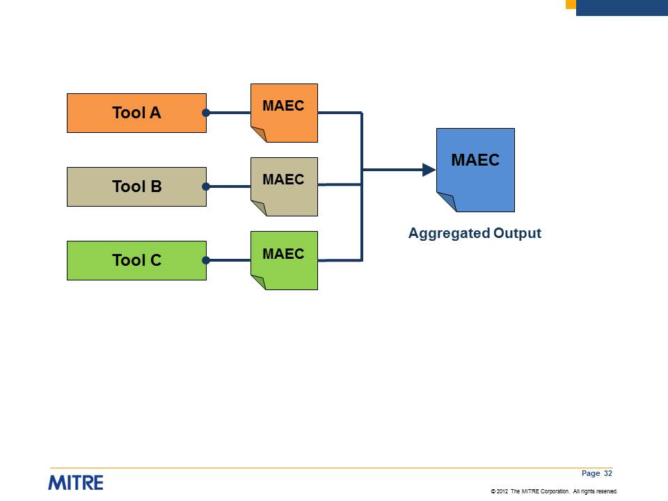

---

layout: flat

title: Standardized Tool Output

---

Reports automatically generated by different malware analysis tools lack consistency. Not only does this make it difficult to correlate output of different tools, it makes it difficult to evaluate the breadth of coverage of individual tools. These issues would be mitigated, and ingestion of tool results into analysis-oriented repositories made easier, if malware analysis tools were to adopt MAEC as a common output format.

Given MAEC’s extensive support for capturing both static and dynamic malware analysis results, MAEC could be used as a standard output format. Native MAEC support is already present in several tools, and translator [utilities are available](/documentation/utils/) for converting some tool outputs into MAEC.

The use of MAEC in standardized tool outputs could serve as objective criteria in the assessment of anti-malware tools.  A tool would be assessed based on its ability to detect all MAEC-defined attributes associated with a malware type or class.
