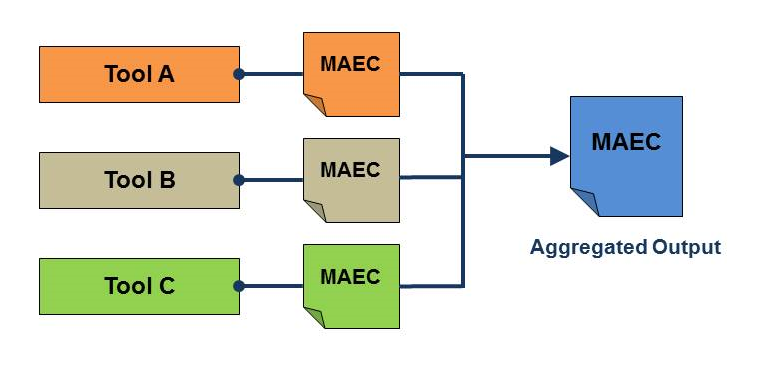

---

layout: flat

title: Standardized Tool Output

---

Like human analysts, malware analysis tools that automatically generate reports lack consistency in reporting.  Not only does this make it difficult to correlate output between tools, it also makes it difficult to evaluate the breadth of coverage of individual tools.  These issues would be mitigated, and ingestion of tool results into analysis-oriented repositories made easier, if malware analysis tools were to adopt MAEC as a common output format, as depicted in the figure.

Given MAEC’s extensive support for capturing the output of both static and dynamic malware analysis, it follows that MAEC could be used as a standard output format for such tools. Native support for MAEC in this manner is already present in several tools, and there are also existing translator utilities for converting certain tool outputs into MAEC.
 

