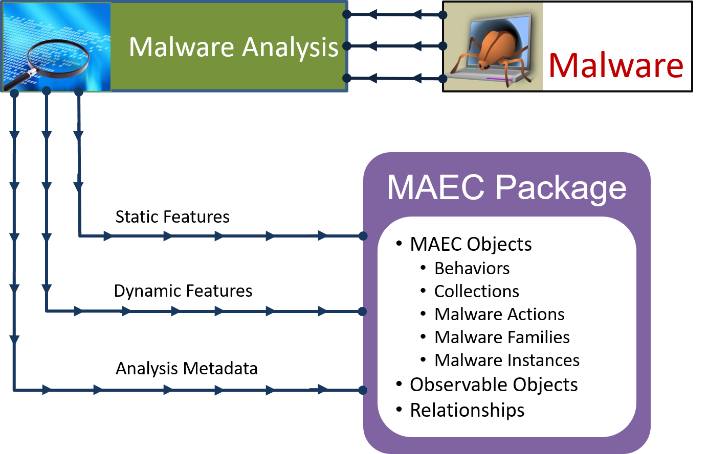

---

layout: flat

title: Static and Dynamic Malware Analysis
---

The analysis of malware using static and dynamic/behavioral methods is critical for understanding the malware’s inner workings.  Information obtained from such analyses can be used for malware detection, mitigation, the development of countermeasures, and as a means of triage for determining whether further analysis is necessary.

In terms of static analysis, MAEC can be used to capture the details extracted from a malware instance.  Details can range from the static attributes of a malware instance binary, such as information on how the instanced was packed, to interesting code snippets obtained from the manual reverse engineering of the instance binary code. 

With regard to dynamic analysis, MAEC can be used to capture details of the particular actions exhibited by executing the malicious binary or code. This can be done at multiple levels of abstraction, starting with the lowest level (which is most commonly captured as some form of native system API call) and extending to higher levels describing a particular unit of malicious functionality, such as keylogging or vulnerability exploitation.

For both static and dynamic analysis, MAEC can capture information on each analysis as a separate item, including the type of analysis performed, information on any tools that were used, and other associated data such as the details of the analysis environment. As such, MAEC permits all analyses for a malware instance to be described in a standard fashion and captured in a single document, the MAEC Package.
